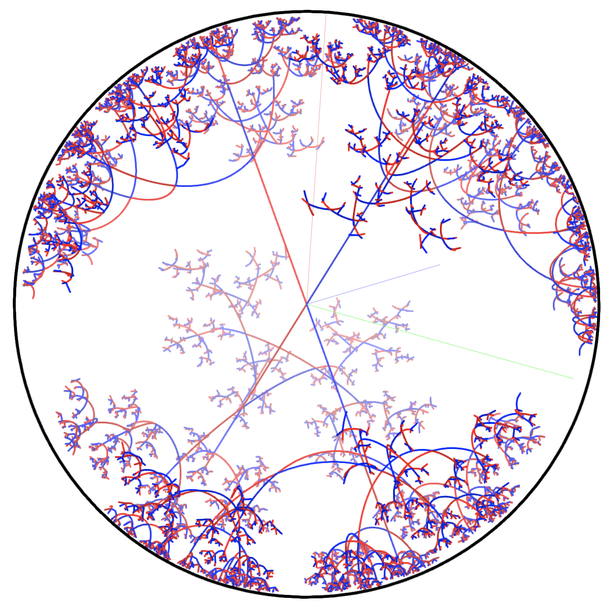

# H3 Visualiser

https://ariymarkowitz.github.io/H3-Visualiser/

This is a visualiser of 2-generated subgroups of SL(2, ℂ) in hyperbolic 3-space.

## About

PSL(2, ℂ) (the group of 2x2 invertible complex matrices, up to scaling) has a natural action on 3-dimensional hyperbolic space by isometries. Given a finite set S of matrices, we may visualise the group G generated by S by the embedding of its Cayley graph in hyperbolic space. That is, we construct a tree whose vertex set is the orbit of some vertex v (the "origin"), and whose edge set is pairs {gv, gsv}, where g ∈ G and s ∈ S. This app visualises H3 using the Poincaré ball model.

## How to use the visualiser

- The 'Depth' input controls the maximum depth of the tree (the length of the largest path from the origin). Warning: Dense groups will take a long time to render at high depth and may cause lag or crash the page.

- The matrix inputs 'Isometry 1' and 'Isometry 2' control the generators of the group. Each entry can be an integer, decimal, imaginary, or complex number (eg. '-1.29', '1 - 1.4i').

- The 2D number input allows for choosing a complex number for a selected entry. To use it, click on the matrix entry you wish to change and then click or drag inside the 2D input box.

- The Poincare ball may be rotated by dragging the mouse, and scaled by scrolling.

- The red edges correspond to isometry 1, and the blue edges correspond to isometry 2. The darker shade (lighter shade in dark mode) indicates that the directed edge pointing away from the origin corresponds to the inverse of the corresponding generator.

- The animation buttons will animate the transformation of the graph by either of the given matrices.

Note: The rendering is optimised by truncating paths with edges that become sufficiently short in euclidean space. In some cases, this can cause large branches to get cut off if the distance to the origin oscillates significantly along a path.
